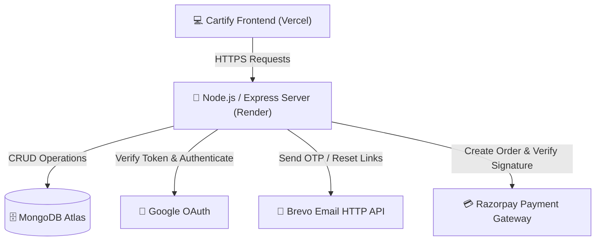

# 🛒 Cartify Backend API

[](https://nodejs.org)
[](https://expressjs.com)
[](https://mongodb.com)
[](https://render.com)

Welcome to the backend engine of **Cartify**, a premium e-commerce platform. This Node.js/Express server powers the catalog, user authentication, profile address book, order placements, and processes secure online payments.

---

## ⚡ Architecture Flow

Here is the high-level architecture of Cartify, showing how the frontend, backend, database, and third-party APIs interact:



---

## 🛠️ Tech Stack & Features

*   **Runtime:** Node.js (Express framework)
*   **Database:** MongoDB Atlas (Mongoose ODM)
*   **Authentication:** 
    *   OAuth 2.0 via Google Login
    *   Password-less OTP Authentication (SMTP locally & **Brevo HTTP API** in production to bypass port blocks)
    *   JWT (JSON Web Tokens) for session management
*   **Payment Gateway:** Integrated with **Razorpay SDK** for secure checkouts
*   **Production Deployment:** Hosted on Render with automatic GitHub deployments

---

## 📖 API Endpoints

### 🔐 Authentication (`/api/auth`)
| HTTP Method | Route | Description | Request Body |
| :--- | :--- | :--- | :--- |
| **POST** | `/send-otp` | Generates & emails a 6-digit login OTP | `{ "email": "user@example.com" }` |
| **POST** | `/verify-otp` | Verifies login OTP and returns JWT token | `{ "email": "user@example.com", "otp": "123456" }` |
| **POST** | `/register` | Fallback Password-based Signup | `{ "name": "Name", "email": "user@example.com", "password": "secure" }` |
| **POST** | `/login` | Fallback Password-based Login | `{ "email": "user@example.com", "password": "secure" }` |
| **POST** | `/forgot-password` | Sends password reset OTP to email | `{ "email": "user@example.com" }` |
| **POST** | `/reset-password` | Verifies reset OTP & saves new password | `{ "email": "user@example.com", "otp": "123456", "newPassword": "new" }` |
| **POST** | `/google` | Google OAuth registration & login | `{ "name": "Google User", "email": "google@gmail.com" }` |
| **PUT** | `/update/:id` | Update user profile name | `{ "name": "Updated Name" }` |
| **DELETE**| `/delete/:id` | Permanently delete user account | *None* |

### 📦 Products (`/api/products`)
| HTTP Method | Route | Description | Request Body |
| :--- | :--- | :--- | :--- |
| **GET** | `/` | Retrieve all trending catalog products | *None* |
| **GET** | `/:id` | Get specific product details by ID | *None* |

### 📍 Addresses (`/api/addresses`)
| HTTP Method | Route | Description | Request Body |
| :--- | :--- | :--- | :--- |
| **POST** | `/add` | Save a new delivery address | `{ "userId": "id", "fullName": "Name", "phone": "123", "street": "st", "city": "city", "state": "state", "pinCode": "111" }` |
| **GET** | `/:userId` | Retrieve all saved addresses of a user | *None* |
| **DELETE**| `/:id` | Delete a saved address by ID | *None* |

### 🛒 Orders (`/api/orders`)
| HTTP Method | Route | Description | Request Body |
| :--- | :--- | :--- | :--- |
| **POST** | `/add` | Place a new purchase order | `{ "userId": "id", "orderItems": [], "shippingAddress": {}, "totalPrice": 1200, "paymentInfo": {} }` |
| **GET** | `/myorders/:userId` | Retrieve order history for a specific user | *None* |

### 💳 Payments (`/api/payment`)
| HTTP Method | Route | Description | Request Body |
| :--- | :--- | :--- | :--- |
| **POST** | `/create-order` | Create a new Razorpay order ID | `{ "amount": 1299 }` |
| **POST** | `/verify-payment` | Verify Razorpay secure signature | `{ "razorpay_order_id": "id", "razorpay_payment_id": "pay_id", "razorpay_signature": "sig" }` |

---

## ⚙️ Environment Variables Config

Create a `.env` file in the root of the project and define the following variables:

```env
# Server Config
PORT=5000
JWT_SECRET=your_super_secret_jwt_key

# Database Connection
MONGO_URI=mongodb+srv://<username>:<password>@cluster.mongodb.net/cartify

# Razorpay Keys
RAZORPAY_KEY_ID=rzp_test_your_key_id
RAZORPAY_KEY_SECRET=your_key_secret

# Local Email / Nodemailer (Fallback)
EMAIL_USER=your_gmail@gmail.com
EMAIL_PASS=your_gmail_app_password

# Production Email (Bypass Render SMTP Blocks)
BREVO_API_KEY=xkeysib-your_brevo_api_key
```

---

## 💻 Local Setup & Execution

1.  **Clone & Navigate:**
    ```bash
    cd Backend
    ```

2.  **Install Dependencies:**
    ```bash
    npm install
    ```

3.  **Run Seed Data (Optional):**
    Populates MongoDB with sample catalog products:
    ```bash
    node seedProducts.js
    ```

4.  **Start Development Server:**
    Runs server with nodemon tracking:
    ```bash
    npm run dev
    ```

---

## 🚀 Deploying to Render

1.  Create a **Web Service** on [Render](https://render.com).
2.  Connect your GitHub repository containing the backend code.
3.  Set the **Build Command** to: `npm install`
4.  Set the **Start Command** to: `npm start`
5.  Go to the **Environment** tab on Render and add all the keys described in the [Environment Variables Config](#-environment-variables-config) section.
6.  Click **Deploy**!
