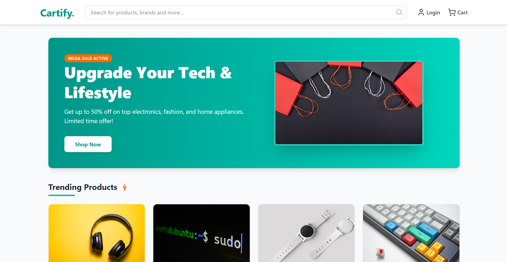
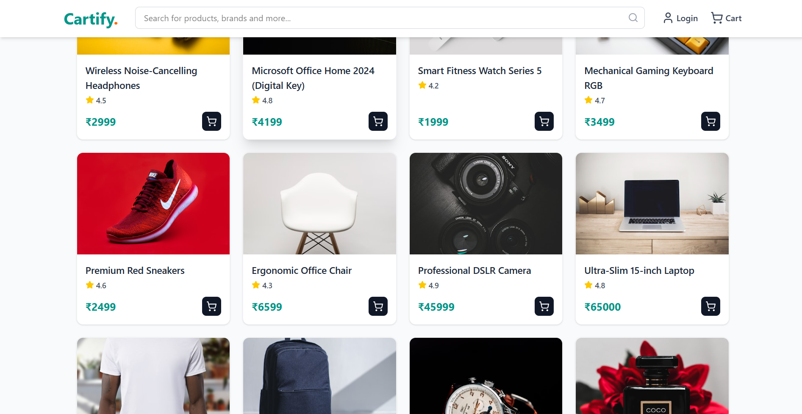

<div align="center">

# 🛒 Cartify

### A modern, fast & responsive e-commerce frontend built with React + Vite

[](https://react.dev/)
[](https://vitejs.dev/)
[](https://tailwindcss.com/)
[](https://cartifystore.vercel.app/)

[🌐 Live Demo](https://cartifystore.vercel.app/) · [🐛 Report Bug](https://github.com/surajrajput999/cartify-frontend/issues) · [✨ Request Feature](https://github.com/surajrajput999/cartify-frontend/issues)

</div>

---

## 📖 About The Project

**Cartify** is a sleek, modern e-commerce shopping cart frontend built from scratch using **React** and **Vite**, styled with **Tailwind CSS**. The goal of this project is to deliver a smooth, fast, and responsive shopping experience — clean product browsing, an interactive cart system, and a UI that feels production-ready.

This is an original project (not a clone), built to sharpen frontend architecture, state management, and UI/UX skills as part of my MERN Stack development journey.

> 🚧 Currently a frontend-only build — backend/API integration is on the roadmap!

---

## ✨ Features

- 🛍️ **Product Listing** — Clean, card-based product browsing UI
- 🛒 **Shopping Cart** — Add, remove & update items in real time
- 💰 **Live Cart Total** — Auto-updating price & quantity calculations
- 📱 **Fully Responsive** — Looks great on mobile, tablet & desktop
- ⚡ **Lightning Fast** — Powered by Vite for instant HMR & optimized builds
- 🎨 **Modern UI** — Styled with Tailwind CSS for a clean, premium look

> 📝 *Building more features? Update this section as you ship them!*

---

## 🛠️ Tech Stack

| Category | Technology |
|---|---|
| **Library** | React |
| **Build Tool** | Vite |
| **Styling** | Tailwind CSS |
| **Linting** | ESLint |
| **Deployment** | Vercel |

---

## 📸 Screenshots

<div align="center">

### 🏠 Home Page


### 🛍️ Trending Products


</div>

---

## 🚀 Getting Started

### Prerequisites

Make sure you have **Node.js** (v16+) and **npm** installed.

```bash
node -v
npm -v
```

### Installation

1. **Clone the repository**
   ```bash
   git clone https://github.com/surajrajput999/cartify-frontend.git
   ```

2. **Navigate to the project folder**
   ```bash
   cd cartify-frontend
   ```

3. **Install dependencies**
   ```bash
   npm install
   ```

4. **Run the development server**
   ```bash
   npm run dev
   ```

5. Open [http://localhost:5173](http://localhost:5173) in your browser 🎉

### Build for Production

```bash
npm run build
```

---

## 🗺️ Roadmap

- [ ] Backend integration (Node.js + Express + MongoDB)
- [ ] User authentication (Login/Signup)
- [ ] Product search & filters
- [ ] Wishlist feature
- [ ] Payment gateway integration

See the [open issues](https://github.com/surajrajput999/cartify-frontend/issues) for a full list of proposed features.

---

## 🤝 Contributing

Contributions, issues, and feature requests are welcome!

1. Fork the project
2. Create your feature branch (`git checkout -b feature/AmazingFeature`)
3. Commit your changes (`git commit -m 'Add some AmazingFeature'`)
4. Push to the branch (`git push origin feature/AmazingFeature`)
5. Open a Pull Request

---

## 📬 Contact

**Suraj Bhan Pratap Singh**

[](https://www.linkedin.com/in/suraj-bhan-pratap-singh-891727293/)
[](mailto:surajdona2005@gmail.com)
[](https://github.com/surajrajput999)

---

<div align="center">

⭐ If you like this project, don't forget to give it a star! ⭐

</div>
