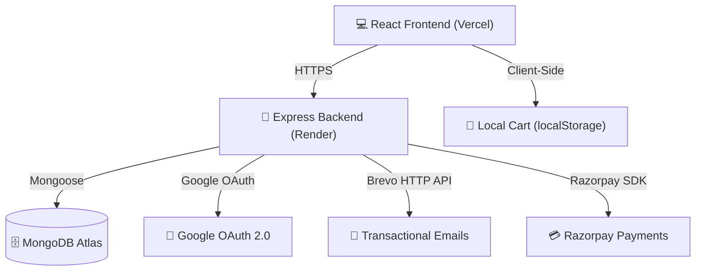

<div align="center">

# 🛒 Cartify

### A Premium Full-Stack E-Commerce Platform — React + Node.js + MongoDB

[](https://react.dev/)
[](https://vitejs.dev/)
[](https://tailwindcss.com/)
[](https://nodejs.org/)
[](https://expressjs.com/)
[](https://mongodb.com/)
[](https://razorpay.com/)
[](https://cartify.vercel.app/)
[](https://cartify-api-10g3.onrender.com/)

🌐 **[Live App](https://cartify.vercel.app/)** · 📘 **[API Docs](#-api-endpoints)** · 🐛 **[Report Bug](https://github.com/surajrajput999/CARTIFY-APP/issues)** · ⭐ **[Star on GitHub](https://github.com/surajrajput999/CARTIFY-APP)**

---

</div>

## 📋 Table of Contents

- [About The Project](#-about-the-project)
- [Screenshots](#-screenshots)
- [✨ Features](#-features)
- [🛠️ Tech Stack](#️-tech-stack)
- [📁 Monorepo Structure](#-monorepo-structure)
- [⚡ Architecture](#-architecture)
- [🚀 Getting Started](#-getting-started)
- [🔌 API Endpoints](#-api-endpoints)
- [🌍 Deployment](#-deployment)
- [📬 Contact](#-contact)

---

## 📖 About The Project

**Cartify** is a production-grade full-stack e-commerce application built from the ground up. It features a sleek React frontend with multi-method authentication, a powerful Express backend with MongoDB, and seamless Razorpay payment integration.

> 🧑‍💻 Built by **Suraj Bhan Pratap Singh** as a portfolio project to demonstrate full-stack development, authentication flows, payment gateway integration, and production deployment on Vercel + Render.

---

## 📸 Screenshots

<div align="center">

### 🏠 Home Page — Product Catalog


### 🛍️ Trending Products Grid


</div>

---

## ✨ Features

### 🔐 Authentication (3 Ways)
| Method | Description |
|--------|-------------|
| 📧 **OTP Login** | Passwordless email OTP via Brevo API — 6-digit code, 10-min expiry |
| 🔑 **Password Auth** | Traditional email/password with bcrypt hashing & JWT |
| 🅶 **Google OAuth** | One-click login with Google account |

### 🛍️ Shopping Experience
- **Product Catalog** — Grid view with category filter, search, pagination (12/page)
- **Product Details** — Full product page with image, ratings, add-to-cart
- **Shopping Cart** — Add/remove/update quantities, live total, localStorage persistence
- **Checkout** — Address selection, order summary, Razorpay payment flow

### 👤 User Dashboard
- **Profile Management** — Edit name, delete account
- **Order History** — View all past orders with status
- **Address Book** — Full CRUD for delivery addresses
- **Account Settings** — Delete account permanently

### 🛠️ Admin Panel
- **Product Management** — Add, view, delete products
- **Bulk Seed** — Insert 20 sample products in one click
- **Image Upload** — Admin-only image upload via Multer (JPEG/PNG/WebP, max 5MB)
- **Clear Database** — Wipe all products safely

### 💳 Payments
- **Razorpay Integration** — Create orders, verify HMAC SHA256 signatures
- **INR Support** — Indian Rupee payments with test mode

### 🎨 UI/UX
- **Fully Responsive** — Mobile, tablet, desktop
- **Tailwind CSS** — Modern utility-first styling, custom brand colors
- **Lucide Icons** — Clean, consistent iconography
- **Toast Notifications** — Real-time feedback with react-hot-toast

---

## 🛠️ Tech Stack

| Layer | Technology | Purpose |
|-------|-----------|---------|
| **Frontend** | React 19 + Vite 8 | UI library & build tool |
| **Styling** | Tailwind CSS 4 | Utility-first CSS |
| **Routing** | React Router DOM 7 | Client-side routing |
| **HTTP Client** | Axios 1 (with JWT interceptor) | API calls |
| **Auth** | @react-oauth/google, jwt-decode | Google OAuth |
| **Icons** | Lucide React | Icon library |
| **Notifications** | React Hot Toast | Toast alerts |
| **Backend** | Node.js + Express 4 | REST API server |
| **Database** | MongoDB + Mongoose 9 | NoSQL ODM |
| **Auth** | JWT + bcryptjs | Token auth & password hashing |
| **Payments** | Razorpay SDK | Payment gateway |
| **Email** | Nodemailer + Brevo API | OTP & password reset emails |
| **Uploads** | Multer | File upload handling |
| **Security** | express-rate-limit | Rate limiting |
| **Frontend Hosting** | Vercel | Edge-deployed frontend |
| **Backend Hosting** | Render | Managed Node.js hosting |
| **Database Hosting** | MongoDB Atlas | Cloud MongoDB |

---

## 📁 Monorepo Structure

```
CARTIFY-APP/
├── Frontend/          # React + Vite frontend
│   ├── public/
│   ├── screenshots/           # App screenshots
│   ├── src/
│   │   ├── api/               # Axios config & interceptors
│   │   ├── components/        # Navbar, HeroBanner, ProductCard
│   │   ├── context/           # AuthContext, CartContext
│   │   ├── pages/             # 7 pages (Home, Cart, Login, Profile, etc.)
│   │   ├── App.jsx            # Router setup
│   │   ├── main.jsx           # Entry point
│   │   └── config.js          # API URL & Razorpay key
│   ├── index.html
│   ├── vite.config.js
│   ├── tailwind.config.js
│   └── vercel.json
│
├── Backend/           # Node.js + Express backend
│   ├── middleware/            # Auth middleware (JWT protect, admin)
│   ├── models/               # Mongoose schemas
│   ├── routes/               # 6 route files
│   ├── utils/                # Email utility
│   ├── scripts/              # Admin setup script
│   ├── server.js             # Express entry point
│   ├── seedProducts.js       # Product seeder
│   └── .env.example
│
├── .gitignore
└── README.md                 # ← You are here
```

---

## ⚡ Architecture



---

## 🚀 Getting Started

### Prerequisites

- Node.js v18+
- npm
- MongoDB Atlas account (or local MongoDB)
- Razorpay test account
- Google Cloud Console project (for OAuth)

### 1️⃣ Clone & Install

```bash
git clone https://github.com/surajrajput999/CARTIFY-APP.git
cd CARTIFY-APP

# Install frontend dependencies
cd Frontend && npm install

# Install backend dependencies
cd ../Backend && npm install
```

### 2️⃣ Configure Backend

```bash
cd Backend
cp .env.example .env   # Fill in your credentials
```

Required environment variables:

| Variable | Description |
|----------|-------------|
| `MONGO_URI` | MongoDB connection string |
| `JWT_SECRET` | Secret key for JWT signing |
| `RAZORPAY_KEY_ID` | Razorpay test key ID |
| `RAZORPAY_KEY_SECRET` | Razorpay test key secret |
| `BREVO_API_KEY` | Brevo transactional email API key |

### 3️⃣ Configure Frontend

```bash
cd Frontend
```

Update `src/config.js` or create `.env`:

```env
VITE_API_URL=http://localhost:5000
VITE_RAZORPAY_KEY=rzp_test_your_key
```

### 4️⃣ Seed Database (Optional)

```bash
cd Backend
node seedProducts.js
```

### 5️⃣ Run Locally

```bash
# Terminal 1 — Backend (http://localhost:5000)
cd Backend
npm run dev

# Terminal 2 — Frontend (http://localhost:5173)
cd Frontend
npm run dev
```

---

## 🔌 API Endpoints

### Authentication (`/api/auth`)
| Method | Route | Auth | Description |
|--------|-------|------|-------------|
| POST | `/send-otp` | — | Send login OTP to email |
| POST | `/verify-otp` | — | Verify OTP & get JWT |
| POST | `/register` | — | Password signup |
| POST | `/login` | — | Password login |
| POST | `/forgot-password` | — | Send reset OTP |
| POST | `/reset-password` | — | Reset password |
| POST | `/google` | — | Google OAuth login |
| PUT | `/update/:id` | JWT | Update profile |
| DELETE | `/delete/:id` | JWT | Delete account |

### Products (`/api/products`)
| Method | Route | Auth | Description |
|--------|-------|------|-------------|
| GET | `/` | — | List (search, category, page, limit) |
| GET | `/:id` | — | Get by ID |
| POST | `/add` | Admin | Add product |
| POST | `/seed` | Admin | Bulk insert |
| DELETE | `/:id` | Admin | Delete product |
| DELETE | `/clear` | Admin | Clear all |

### Orders (`/api/orders`)
| Method | Route | Auth | Description |
|--------|-------|------|-------------|
| POST | `/add` | JWT | Save order after payment |
| GET | `/myorders/:userId` | JWT | User order history |

### Payments (`/api/payment`)
| Method | Route | Auth | Description |
|--------|-------|------|-------------|
| POST | `/create-order` | JWT | Create Razorpay order |
| POST | `/verify-payment` | JWT | Verify payment signature |

### Addresses (`/api/addresses`)
| Method | Route | Auth | Description |
|--------|-------|------|-------------|
| POST | `/add` | JWT | Add address |
| GET | `/:userId` | JWT | Get user addresses |
| DELETE | `/:id` | JWT | Delete address |

---

## 🌍 Deployment

### Frontend — Vercel

| Detail | Value |
|--------|-------|
| **Live URL** | [https://cartify.vercel.app](https://cartify.vercel.app) |
| **Root Directory** | `Frontend` |
| **Framework Preset** | Vite |
| **Environment Variables** | `VITE_API_URL`, `VITE_RAZORPAY_KEY` |

### Backend — Render

| Detail | Value |
|--------|-------|
| **Live URL** | [https://cartify-api-10g3.onrender.com](https://cartify-api-10g3.onrender.com) |
| **Root Directory** | `Backend` |
| **Build Command** | `npm install` |
| **Start Command** | `npm start` |

---

## 📬 Contact

**Suraj Bhan Pratap Singh**

[](https://www.linkedin.com/in/suraj-bhan-pratap-singh-891727293/)
[](mailto:surajdona2005@gmail.com)
[](https://github.com/surajrajput999)

---

<div align="center">

### ⭐ If you like this project, give it a star on GitHub! ⭐

Built with ❤️ using React, Node.js, MongoDB & Razorpay

</div>
